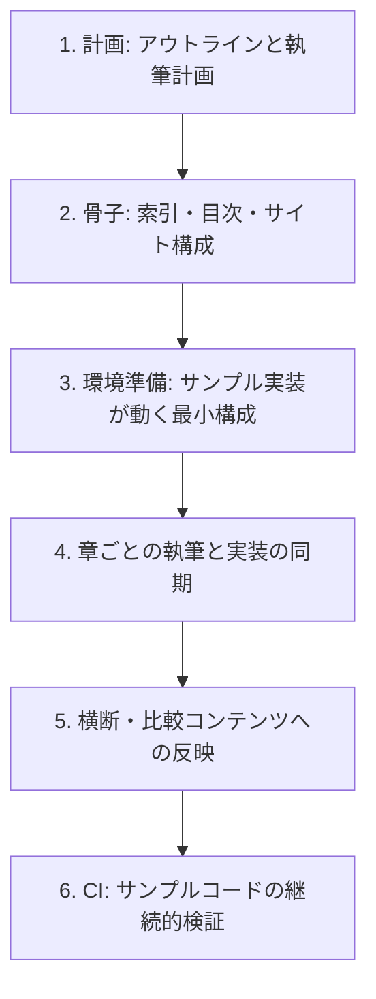

# 技術記事の執筆

動くサンプルコードを伴う技術記事を執筆・更新する。読者は「読んで理解する人」ではなく **「同じ手順を自分の手元で再現しようとする人」** である。

だからこのスキルの中心は文章術ではなく **記事とコードの同期** にある。記事に載せるコードは必ず実際に動作確認済みの実装から転記する。憶測で書いたコードは読者の手元で必ず動かず、記事全体の信頼を失わせる。

本スキルは特定の言語・フレームワーク・サイトジェネレーター・CI サービスに依存しない。記事の配置・サンプル実装の配置・環境定義の方式・サイトのナビゲーション設定は、対象プロジェクトの実構成を確認して当てはめる（憶測で書かない）。

## 適用範囲

| 対象 | 使い方 |
| :--- | :--- |
| 単発の技術記事 | ステップ 1・4・（必要なら 3）だけを使う |
| 連載シリーズの新規立ち上げ | ステップ 1〜6 を通しで使う |
| 既存シリーズへの新しい対象の追加 | ステップ 1〜6 を通しで使う（主な用途） |
| 既存記事の章の増補・更新 | ステップ 4 と、影響する索引の更新 |

「新しい対象の追加」とは、同じ章構成を別の切り口で書き起こす作業を指す（言語別・フレームワーク別・プラットフォーム別など、シリーズの軸に応じる）。

## 全体フロー

区切りごとに、記事（`docs:`）と実装・環境・CI（`feat:` / `chore:` / `ci:`）を分けてコミットする（`git-commit` 準拠、1 コミット 1 目的）。記事と実装を 1 コミットに混ぜると、コードだけを追う読者もレビュアーも差分を追えなくなる。

## 0. 既存構成の把握（着手前に必ず行う）

新規に書き始める前に、対象プロジェクトの実構成を特定する。**既存記事を最低 1 本、できれば性質の近いものを通読する。** 型は説明されるより実物を見るほうが早く揃う。

| 特定する項目 | 例 |
| :--- | :--- |
| 記事ルート | `docs/article/` `docs/blog/` `content/posts/` |
| 計画・目次の一次情報 | `outline.md` `index.md` `workflow.md` |
| サンプル実装の配置 | `apps/{target}/` `examples/{target}/` |
| 実行環境の定義方式 | Nix devShell / Docker / 言語標準のバージョン管理 |
| サイトのナビゲーション | `mkdocs.yml` の nav / `_sidebar.md` / フロントマター |
| CI 定義 | `.github/workflows/*.yml` など |
| 執筆フォーマットの規約 | 記事ルートの `index.md` / `workflow.md` |

既存の規約ドキュメント（`workflow.md` 等）がある場合は **それが一次情報**。本スキルの記述と食い違うときは規約側を正とし、必要なら規約側を更新してから執筆する。

## 1. 計画 — アウトラインと執筆計画

シリーズの計画ドキュメント（例: `outline.md`）に、対象と執筆計画を追加する。

- 対象一覧の表に行を追加する（対象名・環境・章数・備考）。**冒頭の件数表記など、対象数に依存する記述も併せて更新する**（更新漏れが最も起きやすい箇所）。
- シリーズの軸ごとに扱いが変わる部分（対応範囲、省略する章、代替の題材）があれば、その方針を明記する。対象の性質上そのまま書けない章は、**書かないと決めた理由ごと** 残す。
- ファイル構成の図に、記事ディレクトリとサンプル実装ディレクトリを追加する。
- 対象専用の執筆計画の節を設ける。**前提整備**（実行環境・実装雛形・テスト基盤・記事ディレクトリ）と、**章別計画**（各章 1 行で、その対象固有の焦点）を表で示す。

## 2. 骨子への反映

計画に沿って索引を一括で更新する。ここを飛ばすと、記事を書いても読者が辿り着けない。

- **シリーズの索引**: 対象別の一覧と、全章構成の表に行・列を追加。ファイル名は既存対象の命名を踏襲する。
- **進捗管理表**（あれば）: 着手状態と、実行環境の一覧に追記。
- **サイトのナビゲーション**: 対象のセクション見出しを追加する。章は書けたぶんだけ随時追加していく。
- **対象の記事トップ**（`{記事ルート}/{target}/index.md` 等）: 開発環境・章の目次・サンプルコードへのリンク。既存対象の同ファイルを雛形にする。

命名・章構成・体裁は、必ず既存対象の実ファイルを開いて合わせる。

## 3. 環境準備 — サンプル実装が動く最小構成

記事を書き始める前に、TDD サイクルが回る最小構成を用意する。**「最小の 1 テストが通る」ところまで確認してからコミットする。** 環境が整う前に書き始めた記事は、後で必ずコードと食い違う。

- **実行環境の定義**: プロジェクトの方式（Nix devShell / Docker / 言語標準のツール）に合わせ、既存対象の定義を雛形にする。共通のベース環境がある場合はそれを継承し、対象固有のツールチェーンだけを足す。
- **環境の登録**: 環境一覧（flake の `devShells`、Compose のサービス定義など）に追加し、**一覧コマンドでエラーなく認識されることを確認する**。
- **実装雛形**: 対象の標準的な初期化コマンドでプロジェクトを作り、パッケージ定義・`src/`・テストディレクトリ・`.gitignore`・タスク定義（`build` / `test` / `check` / `format` 等）を既存対象に倣って整える。
- **除外設定**: 復元可能なビルド成果物・大きなバイナリ・秘匿情報は `.gitignore` に入れる。

ツールが標準のパッケージ配布に無い場合は、ランタイムだけを提供して初期化時に成果物を取得し、ラッパーを定義する方式でよい。その回避策は記事の環境構築の章にも書く（読者も同じ壁に当たる）。

## 4. 章ごとの執筆と実装の同期

**章単位で「実装 → 執筆」の順に進める。** 逆順にすると、記事に書いたコードを後から実装が裏切る。区切りの良い単位（部・数章）でまとめると進捗が見える。

各章のサイクル:

1. **参照章を読む** — 性質の近い既存対象の同じ章を開き、テーマ・追加仕様・段階の流れを把握する。
2. **サンプル実装（先に手を動かす）** — Red → Green → Refactor を回す（`developing-backend` 参照）。その章で追加する仕様も実装する。
3. **記事執筆** — 参照章と同じ節構成・粒度に合わせつつ、その対象固有の観点（型システム・構文・パラダイム・エコシステム上の強み）を各所で解説する。**コード例は実装と一字一句一致させる。**
4. **サイト反映** — ナビゲーションにその章を追加する。
5. **コミット** — 実装（`feat({target}): ...`）と記事（`docs({target}): ...`）を分ける。進捗管理表も更新する。

### 執筆フォーマット

規約ドキュメントがあればそれに従う。無い場合の既定:

- 見出しは階層を飛ばさない。章内の節構成は既存章と揃える
- コードブロックには言語を明示する。差分を示すときは変更箇所が分かる粒度で切る
- 長い完成コードは折りたたみ（`
`）に入れ、本文には差分だけを載せる
- 日本語と半角英数字の間に半角スペース。文体はですます調。技術用語は英語のまま
- 読者が実行するコマンドは、コピーしてそのまま動く形で書く（プロンプト記号を混ぜない）

## 5. 横断・比較コンテンツへの反映

シリーズに横断解説（対象間の比較・まとめ）がある場合、新しい対象を全ファイルに反映する。作業量が多いので、`Explore` で対象箇所を洗い出してから一括反映するとよい。

- 索引の対象一覧と、冒頭の列挙・件数表記
- 分類表（パラダイム・型システム・ランタイム等、シリーズの軸に応じた分類）
- 各比較章の表・コード例・概念マップ
- その対象固有の強みを、対応する比較節に 1 項目として立てる

反映後は **各表の行・列の整合** と、**旧件数表記の残存が無いこと** を確認する。実在しない事実は書かない。

## 6. CI — サンプルコードの継続的検証

記事のコードは放置すると壊れる。サンプル実装を CI で検証する。既存対象の CI 定義を雛形にする。

- トリガーの `paths` を、その対象のサンプル実装・当ワークフロー・環境定義に絞る（無関係な変更で全対象が回らないように）
- 環境定義と同じ方式でツールチェーンを用意し、キャッシュを効かせる
- 各ステップは環境定義経由で実行し、ローカルと同じコマンドを使う（ローカルと CI でコマンドが違うと、どちらかが必ず腐る）
- 既存 CI と構造・ステップ数を突き合わせてからコミットする（`ci({target}): ...`）

## 完了確認チェックリスト

- [ ] 計画ドキュメントに対象と執筆計画がある（前提整備の状態も更新済み）
- [ ] シリーズ索引の全章構成表・対象別一覧に反映
- [ ] 進捗管理表・環境一覧に反映
- [ ] 記事ディレクトリに index と計画したすべての章
- [ ] サンプル実装の全テストが通り、記事のコード例と一致
- [ ] サイトのナビゲーションに全章
- [ ] 実行環境が定義・登録され、一覧コマンドで認識される
- [ ] 横断・比較コンテンツに反映（表の整合・件数表記を確認）
- [ ] CI が追加され、グリーン
- [ ] 記事と実装・環境・CI を分けてコミット済み

## 注意事項

- 記事に載せるコードは、必ず動作確認済みの実装から転記する。憶測のコードを書かない
- 執筆前に既存記事を 1 本通読する。型は実物を見るほうが早く揃う
- 件数・対象数に依存する記述（冒頭の言語数、章数、比較表の列）は追加のたびに全箇所を更新する
- 個人情報・トークン・社内 URL を記事にもサンプルコードにも残さない
- 章を追加・削除したら、索引・進捗表・サイトナビゲーションを必ず揃える
- 完了後に `operating-docs` の Markdown Lint を通す

## 関連スキル

- `orchestrating-development` — 章単位の執筆・実装の同期
- `developing-backend` — サンプル実装の TDD サイクル
- `operating-docs` — ドキュメント管理・Markdown Lint
- `creating-manual` — エンドユーザー向け操作手順書（読者と目的が異なる）
- `creating-adr` — 設計判断の記録
- `git-commit` — Conventional Commits 準拠のコミット
